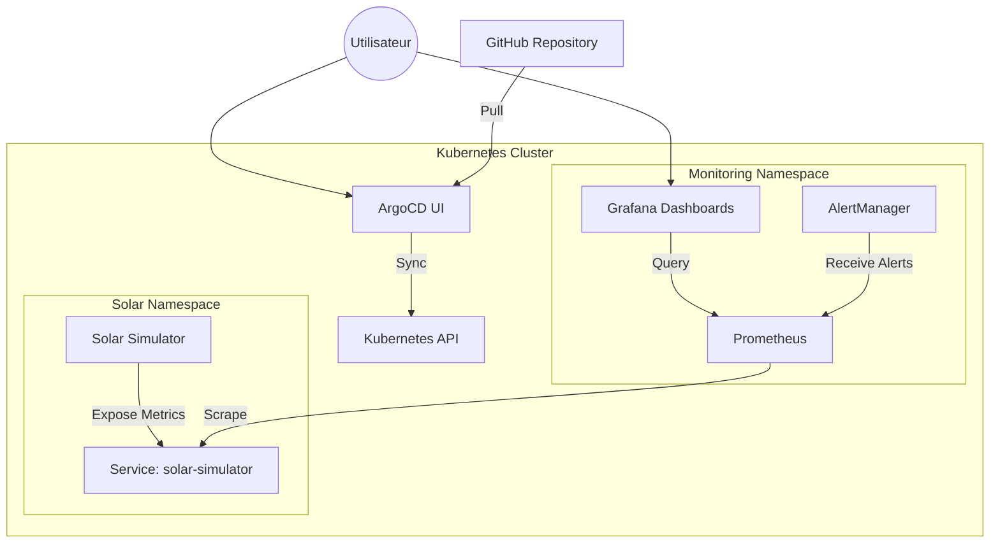

# Architecture du Projet Solaire

## Vue d'ensemble
Ce projet implémente une solution complète de monitoring pour une infrastructure de fermes solaires distribuées. Il suit les principes **GitOps** et **Infrastructure as Code**.

## Schéma

## Composants

### 1. Simulateur Solaire (`src/solar-simulator`)
- **Langage** : Node.js
- **Rôle** : Simule 3 fermes (Provence, Occitanie, Aquitaine).
- **Logique** :
  - Génère des données de production (W), irradiance (W/m²), température (°C).
  - Simule des cycles jour/nuit (1 cycle = quelques secondes pour la démo).
  - Injecte des anomalies aléatoires (surchauffe, panne onduleur).
- **Interface** : Expose `GET /metrics` pour Prometheus.

### 2. Prometheus
- **Rôle** : Base de données de séries temporelles (TSDB).
- **Configuration** : Scrape le simulateur toutes les 5 secondes via ServiceMonitor.
- **Règles** : Évalue les règles d'alerte (Surchauffe, Disponibilité...).

### 3. Grafana
- **Rôle** : Visualisation.
- **Provisioning** : Dashboards et Datasources configurés automatiquement (ConfigMaps).
- **Dashboard** : Vue centralisée de la production et des alertes.

### 4. AlertManager
- **Rôle** : Gestion des notifications.
- **Routing** : Reçoit les alertes de Prometheus et les route (simulé vers webhook local).

### 5. ArgoCD
- **Rôle** : Continuous Delivery (GitOps).
- **Fonctionnement** : Synchronise l'état du cluster avec le dépôt Git.
