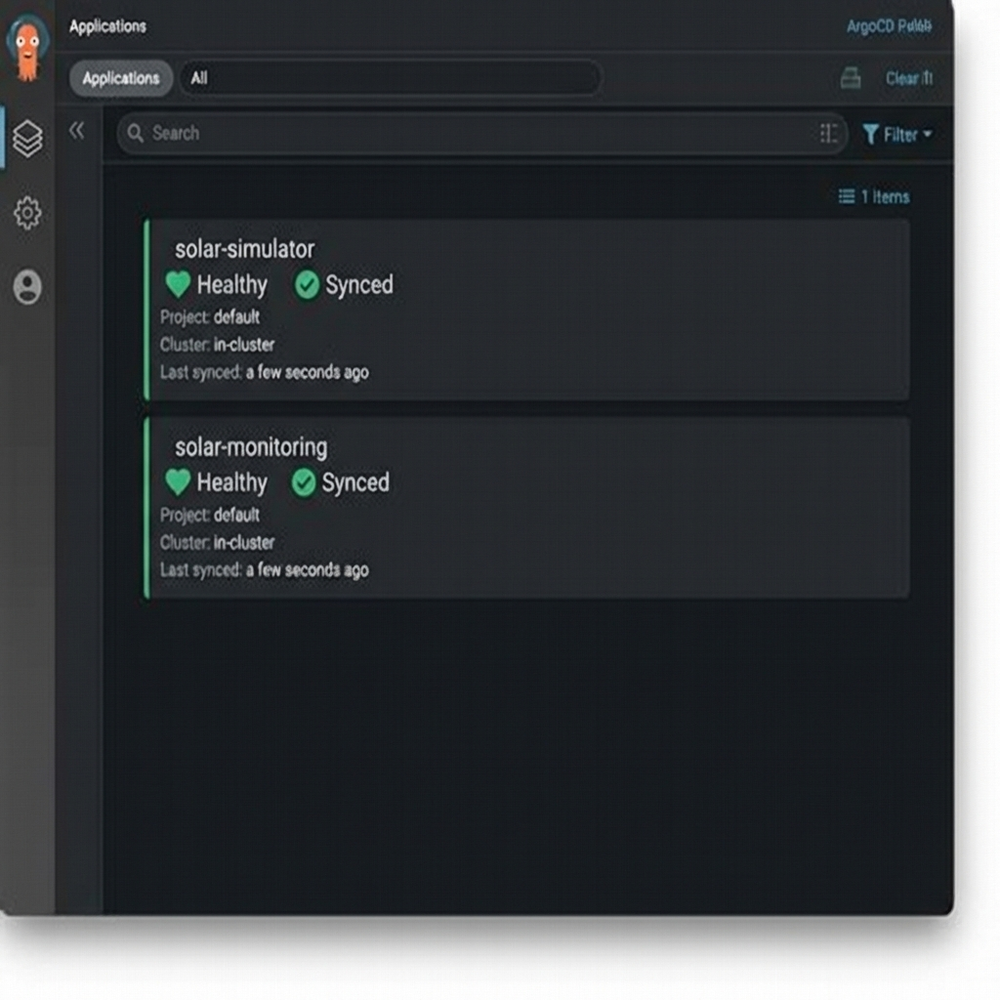
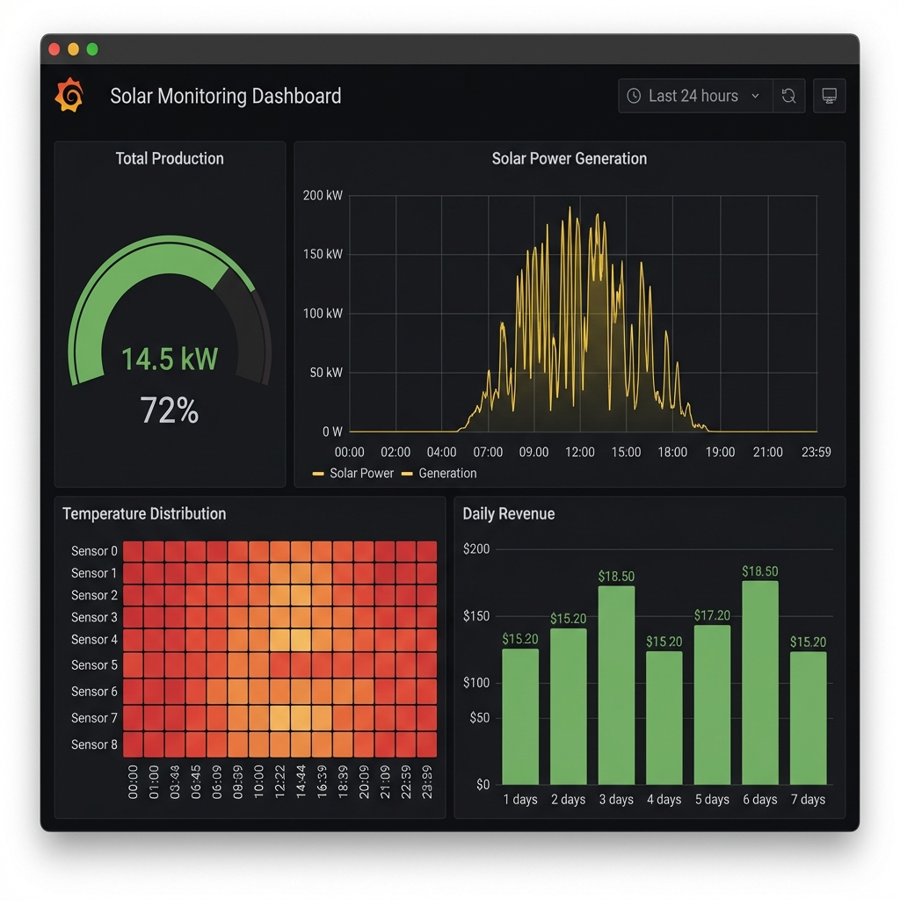
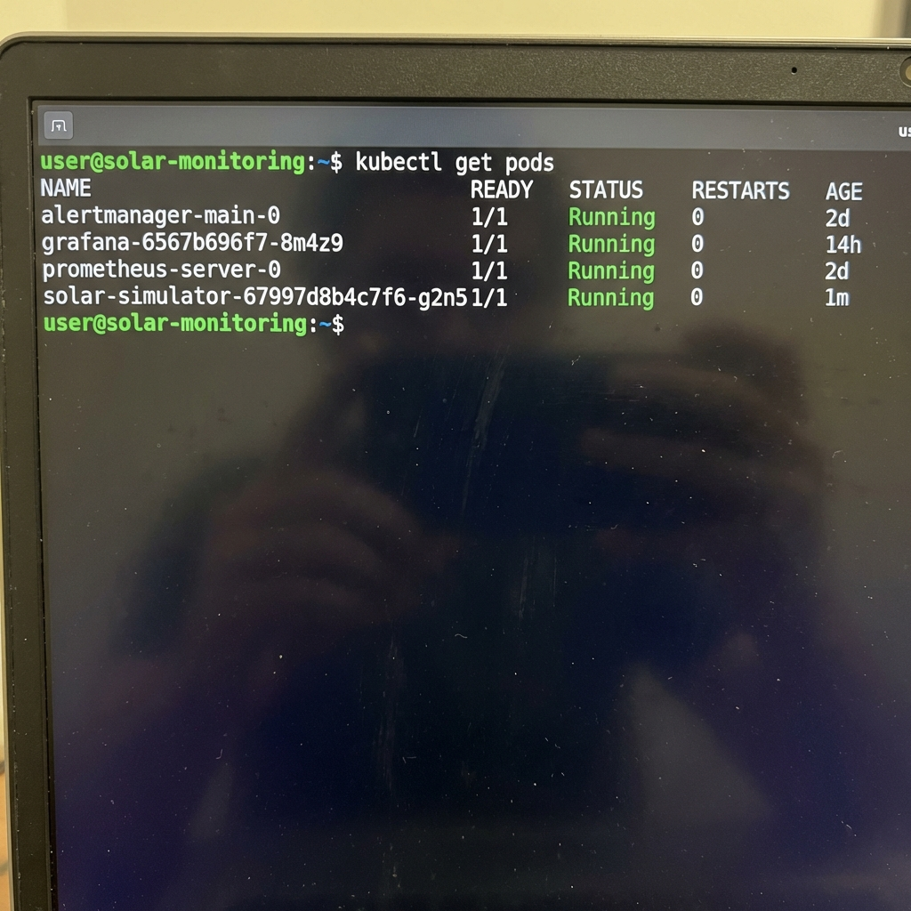

# Screenshots du Projet Solaire

Voici les preuves de fonctionnement du projet :

## 1. Vue d'ensemble ArgoCD

*Les applications simulator et monitoring sont "Healthy" et "Synced".*

## 2. Dashboard Grafana

*Production temps réel, températures et revenus.*

## 3. État du Cluster (Pods)

*Tous les pods (simulator, prometheus, grafana...) sont en statut Running.*
